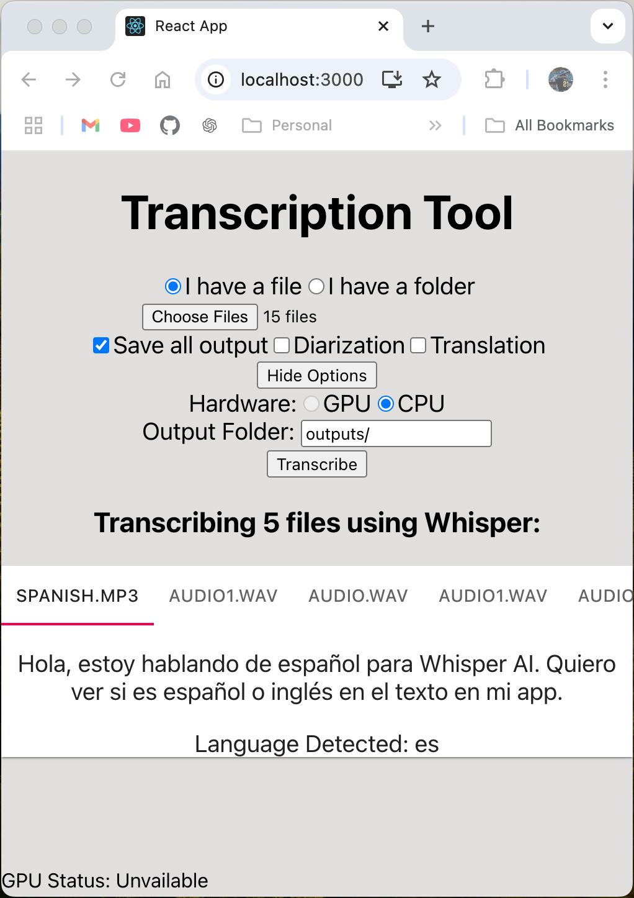

# Audio-Analyzer-and-Transcription-Tool
End to end audio transcription and information extraction from audio input. 

## Starting our Project
1. Ensure you have the Required Dependencies listed below
2. Open your terminal, navigate to our main project directory _(Audio-Analyzer-and-Transcription-Tool)_ and type:
    #### macOS/Linux:
    sh scripts/run.sh
    #### Windows:
    scripts/run

### Required Depenencies
To run our code, the user must:
1. Download our repo
2. Install the latest versions of the following:
    - Node.js
    - python3
    - pip3 _(if not included in your python3 download)_
    - ffmpeg
3. Install additional dependencies listed below.  To let our scripts do this for you automatically, open your terminal, navigate to our main project directory _(Audio-Analyzer-and-Transcription-Tool)_ and type:
    #### macOS/Linux:
    sh scripts/setup.sh
    #### Windows:
    scripts/setup

### setup.sh automatically downloads the following:

- __Node.js installs__: all packages within react-ui/package-lock.json _("npm install")_
- __Python3 installs__: numpy, flask, flask-cors, python-dotenv, torch, torchaudio, openai-whisper, soundfile, librosa, and https://github.com/huggingface/transformers

_(node packages go into react-ui/node_modules/; python packages go into virtual environment created in flask-backend/src/.venv/; nothing outside of our project folder is touched)_

## Using our Product
### Transcribing a file/folder
Easily select a file or folder with our file selection dialog, then click Transcribe!  Your outputs will appear shortly, though longer inputs may take a few minutes to process.
### Choosing options
By default, the selected files are sent for batched transcription, which is the fastest option available if you have GPU access.  However, we provide several optional features which can help significantly in certain circumstances:
### Saving Outputs
Select the Save Outputs checkbox when in GPU mode to automatically save each transcript in a designated output folder; CPU support coming soon.  Output folder path can be a fully qualified path to a new location, or simply a folder name, which will be placed in the project directory folder.
### Diarization
_coming soon_
### Translation
_coming soon_