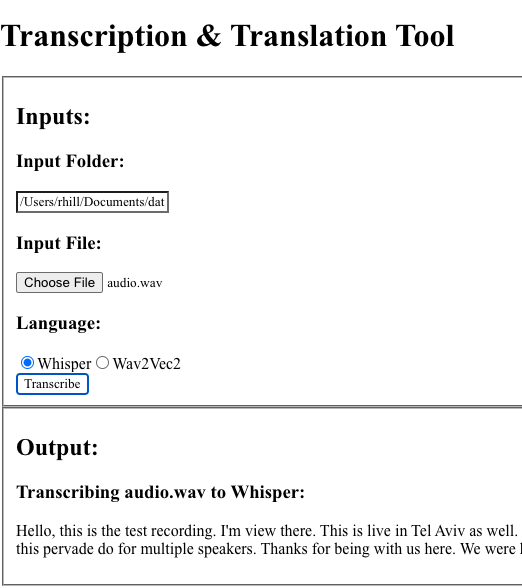

# Audio-Analyzer-and-Transcription-Tool
End to end audio transcription and information extraction from audio input. 

## Starting our Project
1. Ensure you have the Required Dependencies listed below
2. Open your terminal, navigate to our main project directory _(Audio-Analyzer-and-Transcription-Tool)_ and type:
    - macOS/Linux:
        - sh scripts/run.sh
    - Windows:
        - _(coming soon)_

### Required Depenencies
To run our code, the user must:
1. Download our repo
2. Install the latest versions of the following:
    - Node.js
    - python3
    - pip3 _(if not included in your python3 download)_
    - ffmpeg
3. Open your terminal, navigate to our main project directory _(Audio-Analyzer-and-Transcription-Tool)_ and type:
    - macOS/Linux:
        - sh scripts/setup.sh
    - Windows:
        - _(coming soon)_

#### setup.sh automatically downloads the following:

- __Node.js installs__: general node installs _("npm install")_, axios, concurrently
- __Python3 installs__: numpy, flask, flask-cors, python-dotenv, torch, torchaudio, openai-whisper, soundfile

_(node packages go into react-ui/node_modules/; python packages go into virtual environment created in flask-backend/src/.venv/; nothing outside of our project folder is touched)_

## Using our Product
### Choosing a file
#### Whisper
File selected must be located within the directory in the "Input Folder" text field
### Transcription Request
_Options coming soon_

## Analytics
_coming soon_